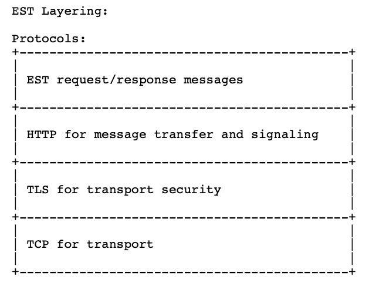

# RFC 7030 - Enrollment over Secure Transport  

### 1. Introduction

Architecturally, the EST service is located between a Certification Authority (CA) and a client. It performs several functions traditionally allocated to the Registration Authority (RA) role in a PKI. 

> 구조적으로, EST 서비스는 CA와 클라이언트 사이에 위치합니다. 기본적으로 PKI에서 RA의 역할에 할당된 여러 기능들을 수행합니다.

 

EST adopts the Certificate Management Protocol (CMP) [RFC4210] model for CA certificate rollover, but it does not use the CMP message syntax or protocol. EST servers are extensible in that new functions may be defined to provide additional capabilities not specified in CMC [RFC5272], and this document defines two such extensions: one for requesting Certificate Signing Request attributes and another for requesting server-generated keys.

> EST는 CA 인증서 갱신을 위해 인증서 관리 프로토콜(CMP) 모델을 채택하지만, CMP 메시지 구문이나 프로토콜을 사용하지 않습니다. EST 서버는 CMC에 명세되어 있지 않은 추가적인 기능들을 정의할 수 있다는 점에서 확장 가능하며, 이 문서에서는 2가지 확장 기능을 정의합니다. 하나는 인증서 서명 요청(CSR) 속성을 요청하기 위한 것이고, 다른 하나는 서버에서 생성된 키들을 요청하기 위한 것입니다.

 

EST specifies how to transfer messages securely via HTTP over TLS (HTTPS) [RFC2818], where the HTTP headers and media types are used in conjunction with TLS. HTTPS operates over TCP; this document does not specify EST over HTTP/Datagram Transport Layer Security/User Datagram Protocol (HTTP/DTLS/UDP). With a suitable specification for combining HTTP, DTLS, and UDP, there are no EST requirements that would prevent it from working over such a stack.

> ESTS는 HTTPS를 통해 메시지를 안전하게 전송하는 방법을 정의합니다. 여기서 TLS와 함께 HTTP 헤더 및 미디어 타입이 사용됩니다. HTTPS는 TCP 상에서 동작하며, 이 문서는 HTTP/DTLS/UDP 상의 EST를 정의하지 않습니다. 단, HTTP/DTLS/UDP 등과 결합하는 적절한 스펙을 이러한 스택에서 동작하지 못하게 하는 EST 요구사항은 없습니다.

 

 

